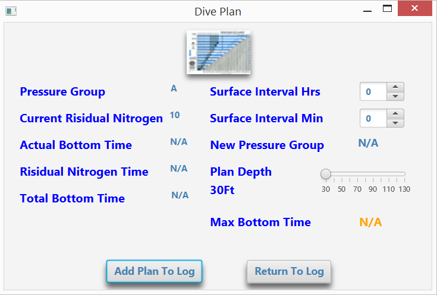

# DiveLog
## SCUBA Dive Log/Planner

This Dive Log App is used by a scuba diver to record the details of dives they have done.This
Serves many purposes that are both safety focused and personal. This Dive Log App Is not only a log book replacement it also replaces the recreational dive plan tables! The dive log can be used by everyone on your dive trip using the same app. The Dive Log numbers and saves your dives just like a log book. It has a planner that tracks your nitrogen time for multiple dives. 

---
### This Dive Log Includes Fields 
 Header |   Profile | Equipment Used|Dive Type | Conditions | Comments & Descriptions | 
--------|-----------|----------------|----------|------------|-------------------------
Name    | Surface Interval|Weights|Fresh Water|Air Temp f|Comments|
Date/Time| Pressure Group|WetSuit|Salt Water|Water Temp f|Tank Pressure Start|
Location|Depth |DrySuit|Shore||Tank Pressure End|
Dive Number| Bottom Time|Hood|Boat|
|| Ending Pressure Group|Shorty|Waves|
|| Residual Nitrogen Time|Gloves|Current|
|| Actual Bottom Time|Boots|Surge|
#### Images of The Dive Log

#### Why I Created This Dive Log
I chose a Dive Log for my capstone project because I have always loved scuba Diving. 
I was certified in spring 2007. I loved diving from the time I took my first breath from the regulator.I started to use my paper log but soon discontinued because it was such a hassle. The book was never complete. It was always wet. I have always wondered why more people don’t use electronic log books.

#### What I Want To Change
This app was created using Java and JavaFx. It Runs from a local server at the moment. I started the project to run from a server so that I could save the logs to the server. About half way through coding this it was made clear to me that a log needs to be a stand alone so it is usable in the ocean or where there is no internet. So the only thing the server does is save the user names and passwords. The server saves these to a hashmap. For the reason that only one key or one password can be stored. So no duplicate passwords. The password has to match the name for login to be successful. To write this out should be fairly simple.

#### Instructions for using this App
* The ServerDiveLog.java has a Main method in it and needs to be running before the DiveLog.java is started. If the server does not output (server started date & time ) the socket needs to be reset.
* The DiveLog.java has the other main method in it that need to be started.
* On the dive log screen (Main screen) the minute spinner is the action event controller.It has to be set to set the other information. On the Dive Planner screen the minute spinner and the depth slider is what sets the other information fields.

